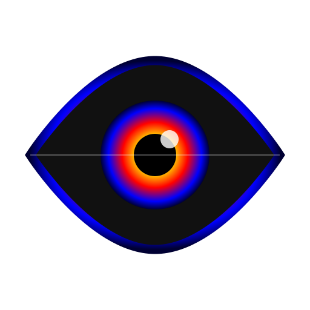
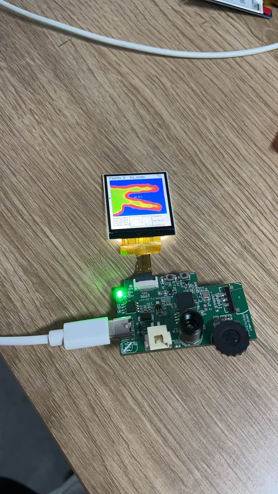

# hot image — Thermal Camera Example

<p align="center">
  
</p>

<p align="center">
  <b>Platform:</b> ESP32-S3 &nbsp;|&nbsp;
  <b>Sensor:</b> MLX90640 (32×24 IR array) &nbsp;|&nbsp;
  <b>Display:</b> ST7789 SPI LCD (240×280)
</p>

---

## Overview / 项目概述

**English:**
This project is a real-time thermal camera built on ESP-IDF v5.5. It reads temperature frames from an MLX90640 Far-Infrared sensor via I²C, applies image processing (Gaussian blur + bilinear interpolation), maps temperatures to a false-color palette, and displays the result on an ST7789 SPI LCD. The firmware supports multiple color palettes, adjustable temperature range (AutoScale or fixed), movable crosshair with persistent position, runtime sleep, and true deep sleep with RTC wake.

**中文:**
本项目是基于 ESP-IDF v5.5 的实时热像仪。通过 I²C 从 MLX90640 远红外传感器读取温度帧，经过图像处理（高斯模糊 + 双线性插值），映射到伪彩色调色板，并在 ST7789 SPI LCD 上显示。固件支持多种调色板、可调温度范围（自动/固定量程）、可移动十字线（位置持久化）、运行时睡眠以及带 RTC 唤醒的真正深度睡眠。

### Screenshot / 效果图

<p align="center">
  
</p>

---

## Hardware / 硬件

| Component | Description |
|-----------|-------------|
| **MCU** | ESP32-S3 (dual-core Xtensa LX7, 240 MHz, 512KB SRAM, optional PSRAM) |
| **Thermal Sensor** | MLX90640 32×24 pixel Far-Infrared array (I²C address 0x33, up to 64 Hz) |
| **Display** | ST7789 SPI LCD, 240×280 pixels, RGB565 |
| **Encoder** | SIQ-02FVS3 rotary encoder (GPIO17/18 for A/B, GPIO8 for switch) |
| **Wheel ADC** | Single-axis analog wheel on GPIO1 (ADC1 CH0) |
| **Status LED** | GPIO21, blinks at boot to indicate power-on |
| **Deep-sleep wake** | Default GPIO1 (RTC-capable); configurable via `DEEP_SLEEP_WAKE_PIN` |

### Pin Summary (默认引脚)

| Function | GPIO |
|----------|------|
| I²C SDA (MLX90640) | Configured in `sdkconfig` (`CONFIG_IIC_IONUM_SDA`) |
| I²C SCL (MLX90640) | Configured in `sdkconfig` (`CONFIG_IIC_IONUM_SCL`) |
| SPI MOSI (LCD) | Configured in display driver |
| SPI CLK (LCD) | Configured in display driver |
| LCD CS / DC / RST / BL | Configured in `st7789.c` |
| Encoder A / B / SW | GPIO17 / GPIO18 / GPIO8 |
| Wheel ADC | GPIO1 (ADC1_CH0) |
| Status LED | GPIO21 |
| Deep-sleep wake | GPIO1 (default, RTC-capable) |

---

## Features / 功能特性

### Rendering / 渲染

| Feature | Description |
|---------|-------------|
| **High-Quality mode** | 2× Gaussian blur → bilinear interpolation to screen size → palette mapping. Best image quality. |
| **Low-Quality mode** | Nearest-neighbor upscale (faster, for 32 Hz). Enabled via `lowQualityRender` flag or menu. |
| **Palette mapping** | Temperature → palette index with adjustable center (`PaletteCenterPercent`). |
| **Multiple palettes** | Iron, Rainbow, Rainbow2, BlueRed, Black & White, Accuracy Mode. Cycle via menu or UI. |

### Temperature Scaling / 温度量程

| Feature | Description |
|---------|-------------|
| **AutoScale** | Dynamically adjusts min/max to each frame's actual range. |
| **Fixed scale** | User-defined `minTempNew` / `maxTempNew`. Set via menu or by confirming `fix_scale` subitem on main screen. |
| **MIN_DISPLAY_RANGE** | When AutoScale is on, ensures a minimum span (e.g., 5°C) to avoid extreme palette mapping in uniform scenes. |
| **Low-range denoising** | Temporal smoothing + optional 3×3 median filter when temperature span is very small. |

### UI / 用户界面

| Element | Description |
|---------|-------------|
| **Title bar (top)** | Shows palette name, `auto_scale` / `fix_scale` status, temperature unit (°C / °F). Gray background highlight when focused. |
| **Thermal image** | Displays processed thermal frame with optional min/max markers (red cross = max, blue X = min). |
| **Data bar (bottom)** | Shows Max / Min / Center temps, actual FPS, settings shortcuts. Gray background highlight when focused. |
| **Crosshair** | Movable reticle; position saved to NVS (`CrossX`, `CrossY`). |
| **Overlay messages** | Temporary on-screen hints (e.g., "Fixed scale saved"). |

### Input / 输入控制

| Input | Action |
|-------|--------|
| **Wheel Right / Confirm** | Enter subitem mode, confirm selection, enter crosshair mode in image area |
| **Wheel Left / Back** | Exit subitem/mode, enter menu from focus mode, save crosshair position |
| **Encoder Rotate** | Navigate subitems, adjust values (temp range, palette center, brightness) |
| **Encoder Press** | Context-dependent (e.g., toggle unit, confirm) |

### Power Management / 电源管理

| Mode | Description |
|------|-------------|
| **Runtime sleep** | Pauses MLX90640 sampling, turns off display/backlight. Wakes on any input event. |
| **Deep sleep** | Calls `esp_deep_sleep_start()` with ext0 wake on `DEEP_SLEEP_WAKE_PIN` (GPIO1 default). Device resets on wake. |

### Persistent Settings (NVS) / 持久化设置

All settings are stored in NVS via `settings_write_all()` and loaded at boot via `settings_read_all()`.

| Setting | Type | Description |
|---------|------|-------------|
| `Emissivity` | float | Object emissivity (0.01–1.0) |
| `ScaleMode` | enum | Interpolation: Original / Linear / HQ3X_2X |
| `MLX90640FPS` | uint8 | Refresh rate index (0–7 → 0.5–64 Hz) |
| `AutoScaleMode` | uint8 | 1 = auto, 0 = fixed |
| `minTempNew` / `maxTempNew` | float | Fixed temperature range |
| `ColorScale` | enum | Palette index |
| `PaletteCenterPercent` | uint8 | Palette midpoint (0–100%) |
| `LcdBrightness` | int | Backlight level (25–100) |
| `CrossX` / `CrossY` | uint8 | Crosshair position |
| `RealTimeAnalysis` | uint8 | Show bottom data bar analysis |

---

## Project Structure / 项目结构

```
hotimage_code_master/
├── main/
│   ├── app_main.c              # Entry point, task creation, LED blink
│   └── CMakeLists.txt
├── components/
│   └── ThermalImaging/
│       ├── include/
│       │   ├── settings.h      # Settings struct & NVS API
│       │   ├── sleep.h         # Sleep/wake API
│       │   ├── palette.h       # Color palettes
│       │   └── ...
│       └── src/
│           ├── task/
│           │   └── render_task_simple.c  # Main render loop, UI, input handling
│           ├── simple_menu.c             # In-app menu
│           ├── settings.c                # NVS read/write
│           ├── sleep.c                   # Runtime & deep sleep
│           ├── lcd/
│           │   └── st7789.c              # Display driver
│           ├── mlx90640/                 # Sensor driver
│           └── ...
├── assets/
│   └── logo.svg                # Project logo
├── partitions.csv
├── sdkconfig
└── README.md
```

---

## Key Source Files / 关键源文件

| File | Purpose |
|------|---------|
| `main/app_main.c` | Initializes display, I²C, settings, creates FreeRTOS tasks (render, mlx90640, wheel, encoder, LED blink). |
| `components/.../render_task_simple.c` | Main render loop: reads MLX frames, computes min/max/center, applies denoising, generates HQ image, draws UI, handles input events. |
| `components/.../simple_menu.c` | Full-screen menu for adjusting AutoScale, min/max temp, palette center, MLX FPS, real-time analysis toggle. |
| `components/.../settings.c` | NVS storage: `settings_storage_init()`, `settings_read_all()`, `settings_write_all()`. |
| `components/.../sleep.c` | `system_enter_sleep()` / `system_exit_sleep()` for runtime sleep; `system_enter_deep_sleep()` for true deep sleep with ext0 wake. |
| `components/.../st7789.c` | ST7789 SPI driver: init, orientation (MADCTL), `st7789_DisplayOn()` / `st7789_DisplayOff()`, backlight control. |

---

## Build & Flash / 构建与烧写

### Prerequisites / 前提条件

- ESP-IDF v5.5 installed and configured
- ESP32-S3 dev board with MLX90640 and ST7789 connected
- Serial port identified (e.g., `COM3` on Windows, `/dev/ttyUSB0` on Linux)

### Commands / 命令

```powershell
# Set target (first time)
idf.py set-target esp32s3

# Clean build (optional but recommended after major changes)
idf.py fullclean

# Build
idf.py build

# Flash (replace COM3 with your port)
idf.py -p COM3 flash

# Monitor serial output
idf.py -p COM3 monitor

# Build + Flash + Monitor in one step
idf.py -p COM3 flash monitor
```

---

## Usage / 使用说明

### Main Screen Navigation / 主界面导航

1. **Focus sections**: Title bar → Image → Data bar. Use **Wheel Left/Right** to switch focus (yellow dot indicator).
2. **Subitem mode**: Press **Wheel Confirm** on Title or Data bar to enter subitem selection. Rotate encoder to navigate subitems.
3. **Crosshair mode**: Press **Wheel Confirm** in Image area to enter crosshair mode. Rotate encoder to move X or Y. Press Confirm again to toggle axis. Press **Wheel Back** to save position and exit.

### Menu / 菜单

Press **Wheel Left** from the main screen to open the Simple Menu:

| Item | Description |
|------|-------------|
| Open Camera | Return to live thermal view |
| Auto Scale | Toggle On/Off |
| Min Temp | Adjust lower bound (fixed scale) |
| Palette Center | Adjust palette midpoint (0–100%) |
| Max Temp | Adjust upper bound (fixed scale) |
| MLX FPS | Toggle 16 Hz / 32 Hz (32 Hz enables low-quality render) |
| Real-time Data Analysis | Toggle bottom data bar |

### Fixing the Temperature Range / 固定量程

1. In AutoScale mode, frame the scene you want to capture.
2. Navigate to the `auto_scale` subitem in the Title bar.
3. Press **Wheel Confirm**. The current frame's raw min/max will be written to `minTempNew` / `maxTempNew`, AutoScale will be disabled, and settings will be saved.
4. An overlay message confirms the action.

### Sleep Modes / 睡眠模式

- **Runtime sleep**: Triggered from menu or code. Pauses sensor, dims display. Any input wakes the device.
- **Deep sleep**: Call `system_enter_deep_sleep()`. Device enters ESP32 deep sleep with ext0 wake on `DEEP_SLEEP_WAKE_PIN`. On wake, the device resets and boots fresh.

---

## Configuration / 配置

### Changing Deep-Sleep Wake Pin / 更改深度睡眠唤醒引脚

Edit `sleep.c`:

```c
#ifndef DEEP_SLEEP_WAKE_PIN
#define DEEP_SLEEP_WAKE_PIN GPIO_NUM_1  // Change to another RTC-capable GPIO
#endif
```

Ensure the chosen GPIO is RTC-capable (on ESP32-S3: GPIO0–21 are RTC GPIOs).

### Adjusting MIN_DISPLAY_RANGE / 调整最小显示范围

In `render_task_simple.c`, find or add:

```c
#define MIN_DISPLAY_RANGE 5.0f  // Minimum temperature span in AutoScale mode
```

Increase for more stable colors in uniform scenes; decrease for finer detail.

### Adding New Palettes / 添加新调色板

1. Define the palette array in `palette.c` / `palette.h`.
2. Add an entry to the `eColorScale` enum in `settings.h`.
3. Update `simple_menu.c` to include the new option.

---

## Troubleshooting / 故障排除

| Symptom | Possible Cause | Solution |
|---------|----------------|----------|
| Display stays black | Backlight off or DisplayOff not restored | Ensure `st7789_DisplayOn()` is called on wake; check backlight GPIO |
| Extreme colors (all red/blue) | Small temperature range + AutoScale | Use `fix_scale` to lock a sensible range, or increase `MIN_DISPLAY_RANGE` |
| No thermal data | I²C wiring or address mismatch | Verify SDA/SCL connections; check MLX90640 I²C address (default 0x33) |
| Deep sleep won't wake | Wake pin not RTC-capable or wrong polarity | Use an RTC GPIO; ensure button pulls pin LOW to wake |
| Low FPS | High-quality rendering is CPU-intensive | Switch to 16 Hz or enable low-quality mode for 32 Hz |

---

## License / 许可证

This project is provided as an example for educational purposes. Check individual component licenses (ESP-IDF, MLX90640 driver, etc.) for redistribution terms.

---

<p align="center"><i>Made with ❤️ for thermal imaging enthusiasts</i></p>
